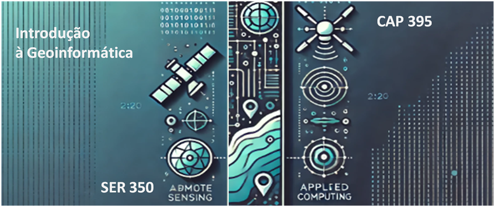

  

## Pós Graduação em Sensoriamento Remoto e Computação Aplicada

  

# **Introdução à Geoinformática - SER 350-3 & CAP 395-3**

Na era do big data, o domínio da geoinformática é essencial para pesquisadores. Esta disciplina apresenta conceitos fundamentais de representação de dados espaciais, bancos de dados geográficos e análise computacional aplicada.

---

### **Informações do Curso**

* **Período**: de 10/03/2026 à 30/05/2026
* **Aulas**: Terças e Quintas das 08:00 às 10:00h
* **Local**: LABGEO do INPE, e excepcionalmente, aulas online.

---

### **Corpo Docente**

* **Professores Responsáveis**: [Dr. Gilberto Queiroz](/doku.php?id=ser300_cap395), [Dra. Karine Reis Ferreira](/doku.php?id=ser300_cap395), [Dra. Lúbia Vinhas](/doku.php?id=ser300_cap395), [Dr. Marcos Adami](http://www.dsr.inpe.br/DSR/institucional/pessoal/servidores/marcos-adami) e [Dra. Silvana Amaral](http://lattes.cnpq.br/3854323052723159)
* **Docentes Colaboradores**: Dr. Édipo Cremon, Me. Gabriel Sansigolo, [Dr. Eymar Lopes](/doku.php?id=ser300_cap395), [Dr. Carlos Felgueiras](/doku.php?id=ser300_cap395), [Dr. Eduardo Camargo](http://www.dpi.inpe.br/quem_somos/eduardo/), Dr. Ricardo Guimarães (IEC-PA)

---

### **Links Úteis**

[Wiki, Instruções de uso](/doku.php?id=ser301:instrucoes_uso)